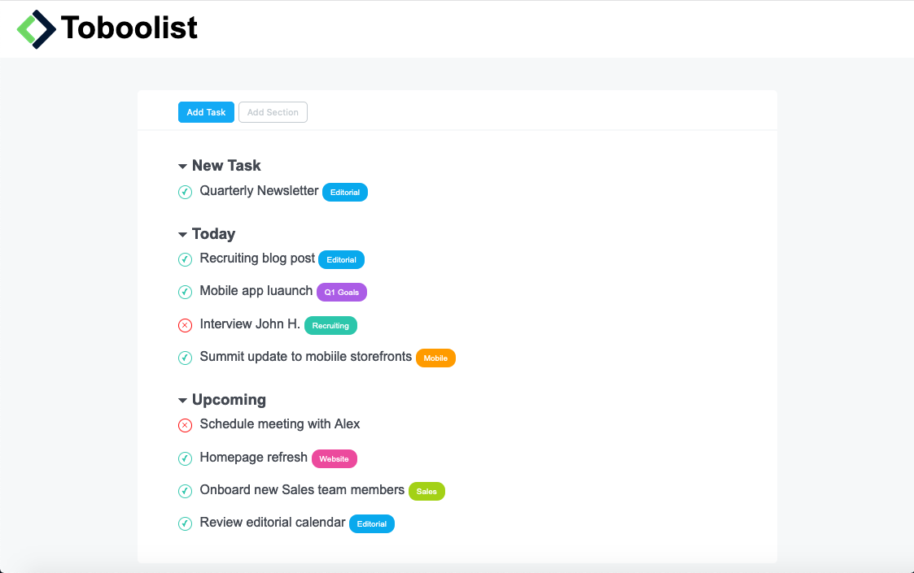

# Toboolist
Ricreiamo una TodoList seguendo il layout in allegato.
Pushate in Github utilizzando VS code e stando attenti, quando create la repo, di rispettare il nome della repo, in questo caso html-css-toboolist.

